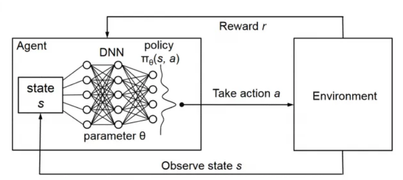

# Virtual_Self_Driving_Car_RL_DeepQ

Q-Learning creates a matrix of rewards that the agent can learn from to learn the optimal policy in the longer term (practical in small and non-continuous environments).

Deep Q-Learning (DQN): Use the actions and states as input values, and receive the Q-Values as outputs (correlating states to Q-Values).

Experience Replay enables the agent to remember and reuse past experiences to its benefit.

A simple implementation of DQN is in a closed environment with an agent that acts as a virtual self-driving car that is equipped with 3 sensors, the goal of the agent is to reach the goal state at the very top-left of the environment and then goes to the opposite direction bottom-right. The agent has to learn to navigate its way in the environment interacting with edges and sands to learn the best possible set of actions to follow (way/direction) to achieve its goal best).

Rewards:
* -1 reward: if the agent hits the obstacles (agent velocity decreases for a short time).
* +1 reward: for reaching the goal.
* +0.1 reward: for heading towards the goal.
* -1 reward: For going too close to the edges of the map.
